# Projekt Szkoła Językowa

[Repozytorium projektu](https://github.com/M3T1X1/kursy_jezykowe)

[Tablica projektowa](https://github.com/users/M3T1X1/projects/5)

---

### Temat projektu

System zarządzania szkołą językową - platforma umożliwiająca zarządzanie kursami językowymi, instruktorami, klientami oraz rezerwacjami.

---

### Zespół

| Imię i Nazwisko | Rola |
| ------ | ------ |
| Kacper Dusza | lider zespołu |
| Radosław Cebula | członek zespołu |
| Dawid Czeszek | członek zespołu |
| Karol Brudniak | członek zespołu |

---

## Opis projektu

Aplikacja służy do kompleksowego zarządzania szkołą językową. System obejmuje zarządzanie kursami różnych języków, instruktorami, klientami oraz procesem rezerwacji. Użytkownicy mogą przeglądać dostępne kursy i zapisywać się na nie. Administratorzy mają dostęp do pełnego panelu zarządzania wszystkimi aspektami szkoły.

Dostępne funkcjonalności:
* Przeglądanie dostępnych kursów językowych z podziałem na poziomy,
* System rejestracji i logowania użytkowników,
* Rezerwacja miejsc na wybrane kursy,
* Panel administracyjny do zarządzania kursami,
* Zarządzanie instruktorami,
* Zarządzanie klientami i ich danymi,
* System transakcji.
* System zniżek i promocji,
* Dashboard z podsumowaniem statystyk,
* Responsive design dostosowany do urządzeń mobilnych

### Narzędzia i technologie
* PHP 8.2
* Laravel Framework 11.x
* PostgreSQL 16.x
* HTML5, CSS3, JavaScript
* Bootstrap 5.3.0
* Composer
* Node.js & NPM
* Git

### Uruchomienie aplikacji

Wymagania:
- PHP 8.2 lub wyższy
- Composer
- PostgreSQL 16.x lub wyższy
- Node.js & NPM

```bash
# Klonowanie repozytorium
git clone [URL_REPOZYTORIUM]
cd projekt-szkola-jezykowa

# Instalacja zależności PHP
composer install

# Instalacja zależności JavaScript
npm install

# Kopiowanie i konfiguracja pliku środowiskowego
cp .env.example .env

# Wygenerowanie klucza aplikacji
php artisan key:generate

# Konfiguracja bazy danych PostgreSQL w pliku .env
# DB_CONNECTION=pgsql
# DB_HOST=127.0.0.1
# DB_PORT=5432
# DB_DATABASE=nazwa_bazy
# DB_USERNAME=uzytkownik
# DB_PASSWORD=haslo

# Utworzenie linku symbolicznego dla storage
php artisan storage:link

# Uruchomienie migracji i seederów
php artisan migrate:fresh --seed

# Uruchomienie serwera deweloperskiego
php artisan serve
```

Przykładowi użytkownicy aplikacji:
* administrator: anna.nowak@example.com / haslo456
* administrator: jan.kowalski@example.com / haslo123
* klient: piotr.zielinski@example.com / haslo789

### Baza danych


**Główne tabele i relacje (PostgreSQL):**

**Tabela `kursy` (Kursy językowe):**
- `id_kursu` (SERIAL PRIMARY KEY) - unikalny identyfikator kursu
- `cena` (DECIMAL(8,2)), `jezyk` (VARCHAR), `poziom` (VARCHAR) - podstawowe dane kursu  
- `data_rozpoczecia`, `data_zakonczenia` (DATE) - harmonogram
- `liczba_miejsc` (INTEGER) - limit uczestników
- `id_instruktora` (INTEGER REFERENCES instruktorzy) - powiązanie z instruktorem
- `zdjecie_url` (VARCHAR) - URL do obrazu kursu
- Denormalizowane dane instruktora (zachowane po soft-delete)
- `created_at`, `updated_at` (TIMESTAMP) - znaczniki czasowe

**Tabela `klienci` (Klienci szkoły):**
- `id_klienta` (SERIAL PRIMARY KEY) - unikalny identyfikator
- `email` (VARCHAR UNIQUE), `imie`, `nazwisko` (VARCHAR) - dane osobowe
- `haslo` (VARCHAR), `adres`, `nr_telefonu` (VARCHAR) - dodatkowe informacje
- `zdjecie_url` (VARCHAR), `role` (VARCHAR DEFAULT 'klient') - profil użytkownika
- `created_at`, `updated_at` (TIMESTAMP) - znaczniki czasowe

**Tabela `instruktorzy` (Instruktorzy):**
- `id` (SERIAL PRIMARY KEY) - unikalny identyfikator
- `imie`, `nazwisko` (VARCHAR) - dane osobowe
- `email` (VARCHAR UNIQUE) - adres email
- `jezyk` (VARCHAR) - specjalizacja językowa
- `poziom` (VARCHAR) - poziom nauczania
- `placa` (DECIMAL(8,2)) - stawka godzinowa
- `zdjecie_url` (VARCHAR) - URL do zdjęcia profilowego
- `deleted_at` (TIMESTAMP) - soft delete
- `created_at`, `updated_at` (TIMESTAMP) - znaczniki czasowe

**Tabela `transakcje` (Historia płatności):**
- `id_transakcji` (SERIAL PRIMARY KEY) - unikalny identyfikator
- `id_kursu` (INTEGER REFERENCES kursy) - powiązanie z kursem
- `id_klienta` (INTEGER REFERENCES klienci) - powiązanie z klientem  
- `kurs_jezyk`, `kurs_poziom` (VARCHAR) - denormalizowane dane kursu
- `klient_imie`, `klient_nazwisko`, `klient_email` (VARCHAR) - denormalizowane dane klienta
- `cena_ostateczna` (DECIMAL(8,2)), `status` (VARCHAR), `data` (TIMESTAMP) - szczegóły transakcji
- `reservation_id` (INTEGER REFERENCES reservations) - powiązanie z rezerwacją

**Tabela `reservations` (Rezerwacje):**
- `id` (SERIAL PRIMARY KEY) - unikalny identyfikator
- `imie`, `nazwisko`, `email`, `nr_telefonu` (VARCHAR) - dane rezerwującego
- `course_id` (INTEGER REFERENCES kursy) - powiązanie z kursem
- `base_price` (DECIMAL(8,2)) - cena bazowa
- `created_at`, `updated_at` (TIMESTAMP) - znaczniki czasowe

**Tabela `znizki` (System promocji):**
- `id_znizki` (SERIAL PRIMARY KEY) - unikalny identyfikator  
- `nazwa_znizki` (VARCHAR) - nazwa promocji
- `wartosc` (DECIMAL(5,2)) - wartość zniżki (procent)
- `opis` (TEXT) - szczegóły promocji
- `active` (BOOLEAN DEFAULT true) - status aktywności
- `created_at`, `updated_at` (TIMESTAMP) - znaczniki czasowe

**Tabela `klienci_znizki` (Powiązania klient-zniżka):**
- Tabela łącząca klientów ze zniżkami (many-to-many)
- `id` (SERIAL PRIMARY KEY)
- `id_klienta` (INTEGER REFERENCES klienci)
- `id_znizki` (INTEGER REFERENCES znizki)
- `created_at`, `updated_at` (TIMESTAMP)

**Kluczowe relacje:**
- Jeden instruktor może prowadzić wiele kursów (1:N)
- Jeden kurs może mieć wiele transakcji (1:N) 
- Jeden klient może mieć wiele transakcji (1:N)
- Jeden kurs może mieć wiele rezerwacji (1:N)
- Klienci i zniżki w relacji many-to-many

**Indeksy PostgreSQL:**
- Indeksy na kluczach obcych dla lepszej wydajności
- Indeks na `email` w tabelach `klienci` i `instruktorzy`
- Indeks na `data_rozpoczecia` w tabeli `kursy`
- Indeks na `status` w tabeli `transakcje`

## Widoki aplikacji 

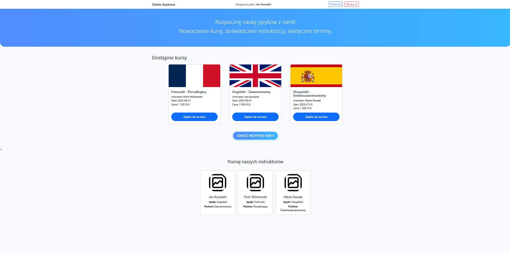
*Strona główna z losowymi kursami i instruktorami*

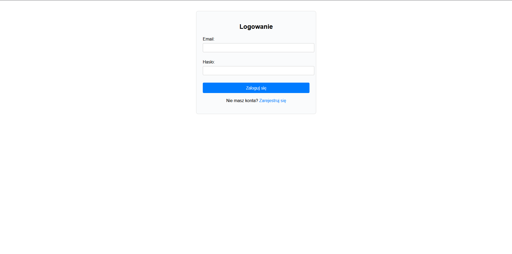
*Strona logowania*

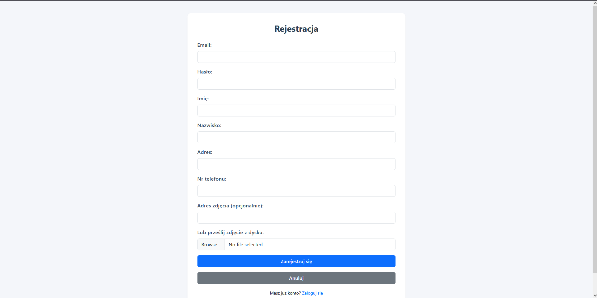
*Strona rejestracji*

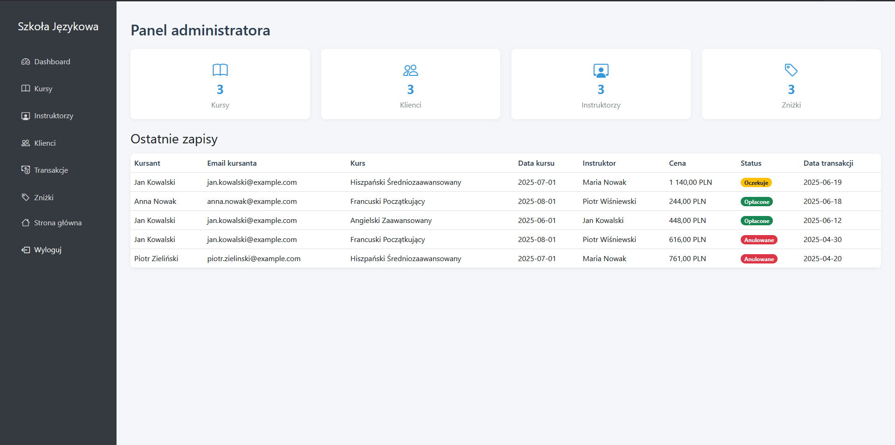
*Strona Dashboard*

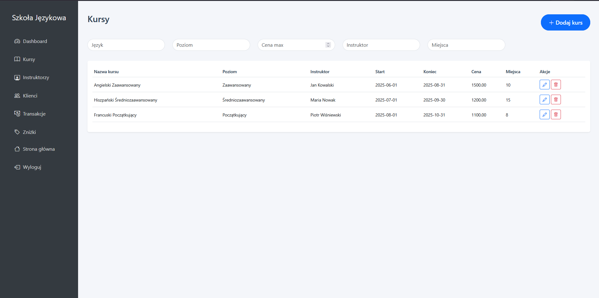
*Strona kursów w dashboard*

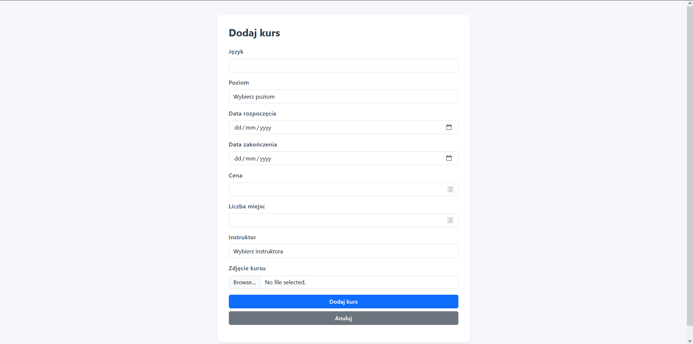
*Strona dodania kursu*

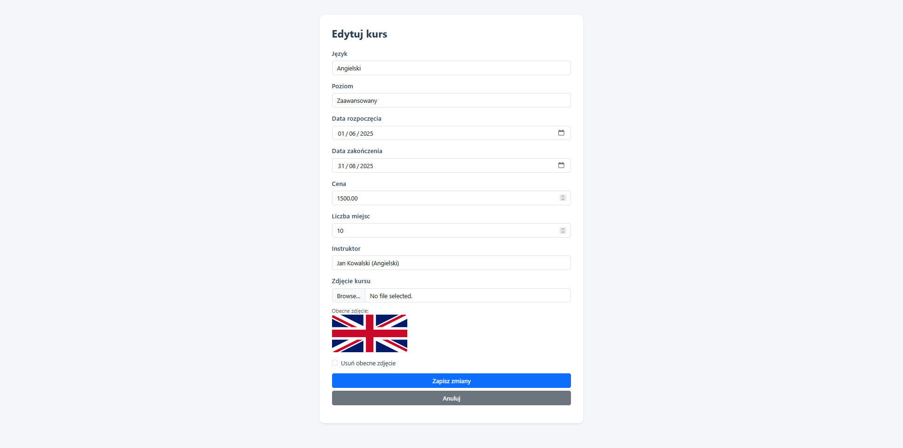
*Strona edycji kursu*

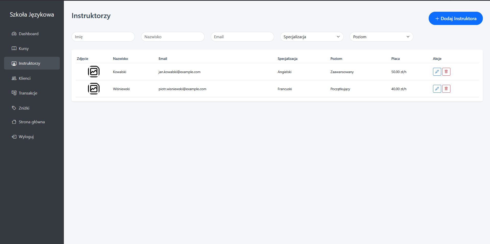
*Strona instruktorów w dashboard*

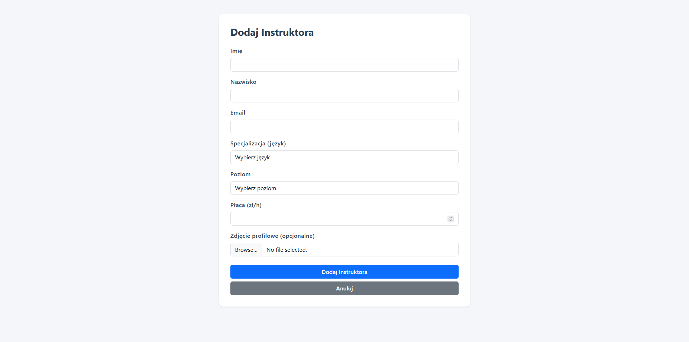
*Strona dodania instruktora*

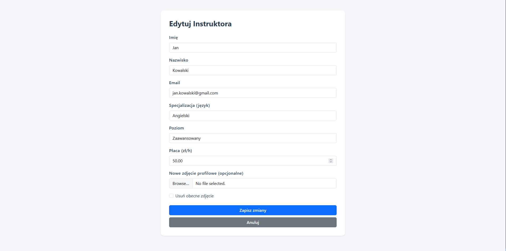
*Strona edycji instruktora*

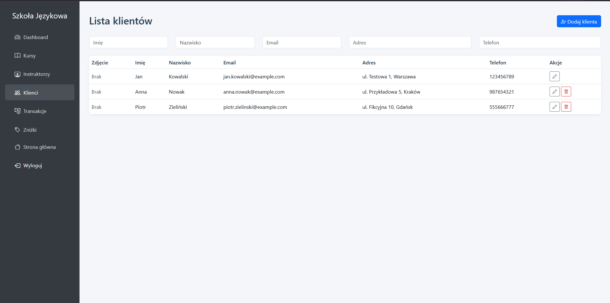
*Strona z klientami w dashboard*

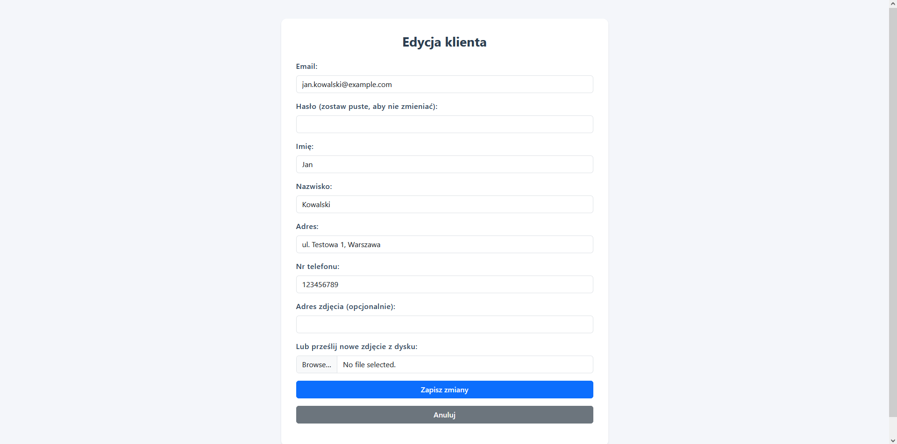
*Strona z edycją klienta*


*Strona z dodaniem klienta*

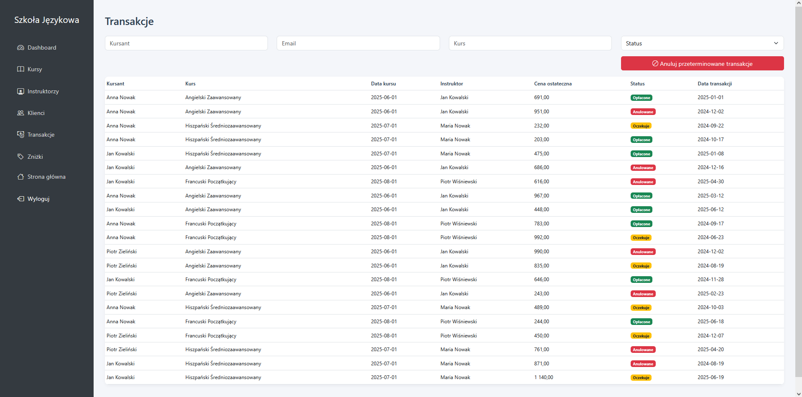
*Strona z transakcjami*

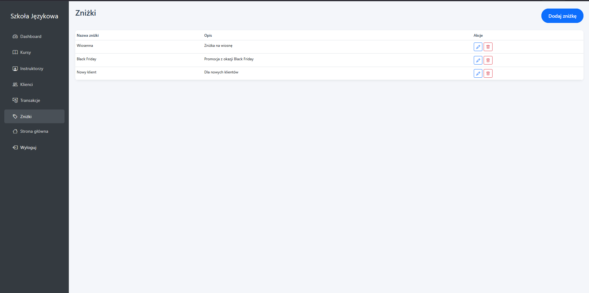
*Strona z zniżkami*

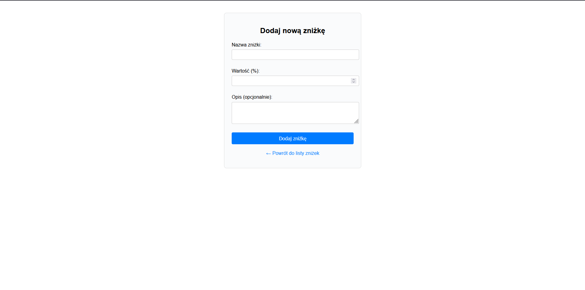
*Strona z dodaniem zniżki*


*Strona z edycja znizki*

## Funkcjonalności szczegółowe

### System użytkowników
- Rejestracja i logowanie
- Role: administrator, klient
- Zabezpieczenia sesji i autoryzacji

### Zarządzanie instruktorami
- CRUD z systemem soft-delete
- Upload zdjęć z automatycznym nazewnictwem
- Relacje z kursami zachowane po "usunięciu"

### System kursów
- Różne języki i poziomy zaawansowania
- Upload zdjęć kursów
- Ograniczenia miejsc
- Daty rozpoczęcia i zakończenia

### Rezerwacje i płatności
- System rezerwacji z walidacją miejsc
- Historia transakcji
- Integracja z systemem zniżek

### Panel administracyjny
- Dashboard z kluczowymi statystykami
- Filtry i wyszukiwanie w tabelach
- Responsywny interfejs
- Eksport danych

### Zalety PostgreSQL w projekcie
- Zaawansowane typy danych (JSON, ARRAY)
- Silne zabezpieczenia i integralność danych
- Wydajność przy złożonych zapytaniach
- Wsparcie dla full-text search
- Atomowość transakcji (ACID)
- Obsługa równoległych połączeń